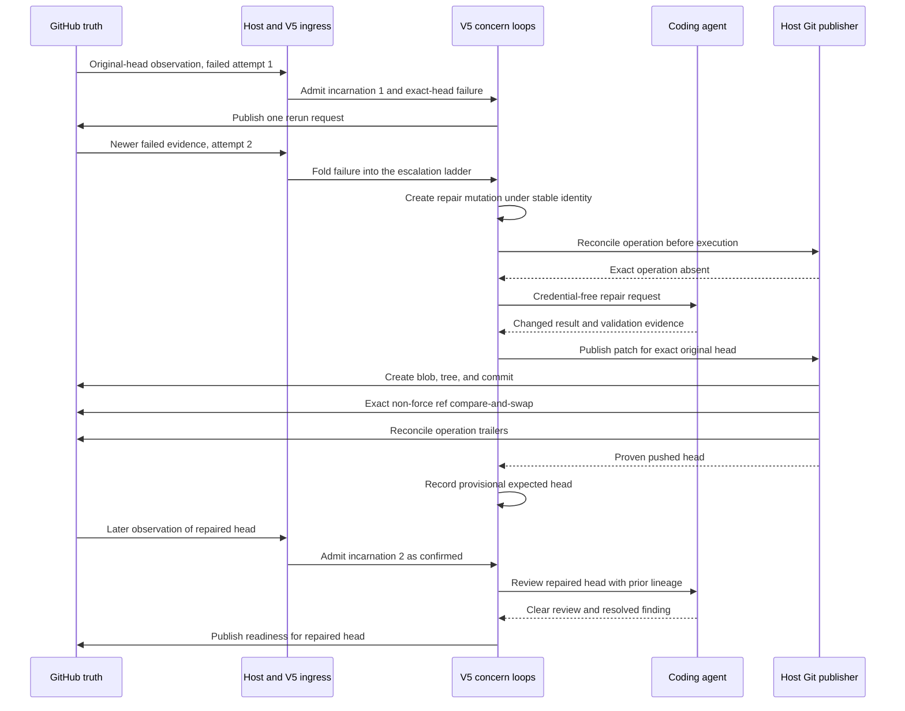

# Agent-repair journey

This is the second guided reading route for ES-009. It follows one automatic
repair from repeated exact-head CI failure through coding, exact Git ref
compare-and-swap, repaired-head admission, review resolution, and readiness.

## Terminology correction

In the current V5 system, an **agent repair** is an automatic escalation. Failed
CI is rerun once; strictly newer failed evidence after that proven rerun creates
a typed `MutationRequest(kind="repair")`. The evidence, rather than a human
comment, authorizes that rung of the bounded escalation ladder.

An explicit human instruction such as `@hamsterdan fix the readiness guard`
follows the conversational `change` route. `repair` is absent from the declared
human intents in `host/v5/application.py`. Both producers later converge on the
same mutation baton, coding boundary, and Git publisher.

The semantic journey named `test_agent_repair_user_journey` exercises the
automatic route and asserts that the conversation agent is never called.

## Scenario

`tests/integration/host/test_readiness_scenarios.py` creates a real local Git
repository whose feature branch contains this defect:

```python
def ready(mergeable, all_gates_clear):
    if all_gates_clear:
        return True
    return False
```

The journey supplies:

- an open, non-draft PR at incarnation 1;
- failed required run 101, attempt 1;
- one qualifying human approval and no unresolved thread;
- a blocking agent-review finding about the missing mergeability guard;
- one brokered rerun which returns run 101, attempt 2, still failed;
- a deterministic coding result which changes the guard to
  `if mergeable and all_gates_clear:`; and
- a real local Git object and ref publication behind controlled GitHub
  transports.

The CI failure causes the repair. The seeded review finding supplies prior
review context which the repaired-head review later resolves, but it does not
trigger the coding request.

The externally visible result is one rerun marker, one finding publication, one
mutable dashboard, one exact branch update, and one immutable readiness
advisory for the repaired head. No merge, force update, duplicate branch update,
or readiness advisory for the original head is allowed.

## Vertical sequence



Independent Petri folds may interleave. The sequence names causal boundaries,
not one global transition order.

## 1. Establish exact-head failure

Read:

- `src/hamsterdan/readiness/net_v5/ci.py` — failed `RunWork` assessment;
- `src/hamsterdan/readiness/net_v5/esc.py` — `_decide`; and
- `tests/integration/host/test_readiness_scenarios.py` —
  `ScenarioProvider.complete_rerun` and `_run_journey`.

The first failure for one `{lineage}:{fingerprint}` creates a `RerunReq`. The
ladder holds its baton while that effect is unresolved. A failed or ambiguous
rerun terminal cannot authorize branch mutation.

After the rerun is proven landed, only strictly newer failed evidence advances
the ladder. In this scenario, run 101 attempt 2 is newer than attempt 1 and has
the same failure fingerprint. `_decide` records the repair rung as pending and
emits:

```text
MutationRequest(
  op="repair:<lineage>:<fingerprint>",
  rid="repair:<lineage>:<fingerprint>",
  source="escalation",
  kind="repair",
  instruction="",
  run_id=101,
  attempt=2,
)
```

A duplicate observation at attempt 1 or 2 does not create another repair.

## 2. Serialize the mutation and mint its identity

Read:

- `src/hamsterdan/readiness/net_v5/mutation.py` — `_op_key` and `_start`;
- `src/hamsterdan/host/v5/mutation.py` — `V5MutationGate.request`; and
- `src/hamsterdan/contracts/readiness_v5.py` — `MutationRequest`, `MutWork`,
  `Pushed`, `FaultM`, and `ProvisionalHead`.

`MutState` is the one-at-a-time branch-mutation baton. `_start` consumes the idle
baton and emits one `MutWork`; a terminal fold returns the baton. A faulted baton
retains the exact operation and declines later mutation requests before any gate
attempt.

The journey's stable publication operation is:

```text
push:repair:<lineage>:<failure-fingerprint>:<original-head>:i1
```

`V5MutationGate` derives a globally scoped coding operation from it:

```text
mutation:owner/repo:pr:7:<publication-operation>
```

The request contains the exact failed head, run 101, attempt 2, failure
fingerprint, and repair-budget lineage. It contains no human instruction. A
SHA-256 payload digest binds the semantic operation, policy digest, and complete
coding request.

## 3. Reconcile before agent work

Read:

- `src/hamsterdan/host/v5/mutation.py` — `V5MutationGate.git_gate`; and
- `src/hamsterdan/host/git_publish.py` — `HostGitPublisher.reconcile`.

The mutation gate asks the Git publisher whether the stable operation already
exists before reading current authority or invoking the agent. Reconciliation
requires GitHub's PR projection and the remote ref to agree, then searches the
complete first-parent history for the exact operation and payload-digest
trailers.

If the operation already exists, the gate returns `Pushed` without another agent
call, object write, or ref update. An unreadable or contradictory lookup returns
a fault rather than treating uncertainty as absence.

## 4. Fence and execute the coding attempt

Read:

- `src/hamsterdan/host/v5/mutation.py` — the pre-agent and post-agent claim
  comparisons;
- `src/hamsterdan/host/agenticus.py` — `RoutedAgentRunner.code`;
- `src/hamsterdan/agents/pi.py` — `PiNativeRunner._run`, `_run_workspace`, and
  `_wait`; and
- `src/hamsterdan/host/pi_workspace.py` — host-derived workspace
  reconciliation.

The expected claim includes running phase, incarnation, head, base, and policy.
The host compares that full claim before and after the coding attempt. The Pi
runner also receives an `is_current` callback and checks it before workspace
execution and while waiting.

The routed-agent store durably binds the logical operation to one exact agent
composition. Pi derives its operation ID from the logical operation and attempt.
The agent receives a public credential-free repository URL and a bounded typed
request, never GitHub installation authority.

For changed coding output, the host reconstructs the settled workspace archive
and replaces model-reported diff and changed-file claims with host-derived
values before final protocol validation. A changed repair requires confirmed
reproduction and non-empty validation evidence.

The semantic journey uses `ScenarioRunner` rather than an actual Pi process. It
asserts the request and result contract, known credential canaries, and
operation identities. Pi runtime, workspace archive, cancellation, and cleanup
behavior are tested separately.

## 5. Publish Git objects and advance the branch

Read:

- `src/hamsterdan/host/git_publish.py` — `HostGitPublisher.publish`;
- `src/hamsterdan/github_app/authority.py` — object creation; and
- `src/hamsterdan/github_app/transport.py` — GraphQL ref compare-and-swap.

The host publisher:

1. validates request/result correlation and declared paths;
2. reconciles the operation again;
3. rejects fork or unsafe PR refs;
4. clones through a credential-free URL with ambient Git credentials and hooks
   disabled;
5. checks out the exact expected head and applies the patch to the index;
6. validates staged paths, modes, and the host-derived tree;
7. creates provider blob, tree, and commit objects;
8. puts the stable operation and payload digest in host-owned commit trailers;
9. freshly rereads the PR; and
10. advances `refs/heads/feature` with exact `beforeOid`, exact `afterOid`, and
    `force=False`.

The final ref operation atomically fences the head. Base, policy, and lifecycle
cannot be made atomic with GitHub's ref update, so fresh full-claim reads narrow
that accepted race.

After compare-and-swap, the publisher reconciles again. Success means the PR
projection and remote ref agree and exactly one commit with the expected parent
and trailers is present. An accepted provider call alone is not treated as
proof.

The focused journey asserts this exact order:

```text
reconcile absent
  -> create blob
  -> create tree
  -> create commit
  -> exact ref compare-and-swap
  -> reconcile existing
  -> publish returns
```

## 6. Keep the new head provisional

Read:

- `src/hamsterdan/readiness/net_v5/mutation.py` — `_fold_pushed`; and
- `src/hamsterdan/readiness/net_v5/life.py` — `_note_provisional` and
  `_admit_head`.

A proven `Pushed` terminal settles the mutation and emits `ProvisionalHead` with
both the expected new head and the original `from_head`. This is durable
pending-head-admission state: committing human intents are declined while the
expectation remains, but the workflow continues processing lifecycle, authority,
and recovery observations. A webhook or periodic reconciliation must still
observe and admit the provider head before repaired-head CI or review begins.

Lifecycle records the expectation only while it still stands on the head which
the push moved from. This fence makes a late provisional note inert if a webhook
has already admitted the new head or the branch moved again.

The expectation also preserves the repair-budget lineage. If the repaired head
fails with the same fingerprint, it does not receive a fresh automatic rerun and
repair budget merely because it is new code produced by Hamsterdan. Without the
expected-head correlation, lifecycle would classify the head as `superseded`, CI
would mint a new lineage, and repeated automatic repairs could each earn a fresh
budget.

Git publication changes provider state; it does not directly rewrite workflow
authority. The journey proves the boundary by checking that, immediately after
publication, only the original-head review exists, the dashboard does not name
the repaired head, and no readiness advisory exists. The exact
`ProvisionalHead` type is one implementation; any alternative must retain the
expected head, replaced head, operation, lineage, and race behavior somewhere.

## 7. Admit and evaluate the repaired generation

A later signed `pull_request/synchronize` delivery causes fresh provider
normalization. The host atomically stages a new ingress manifest and authority
grant before delivering the new head to History.

`life._admit_head` sees that the observed head matches the expected provisional
head. It admits incarnation 2 with relation `confirmed`, keeps the repair
lineage, clears the expectation, and emits new exact-head work to CI and review.

The deterministic provider supplies successful run 102 for the repaired head.
The second review receives the prior blocking finding and its applied-change
lineage, then returns a clear review with that finding resolved.

Readiness requires successful checks, a clear review, zero blocking findings,
approval, no changes requested, no unresolved threads, mergeability, base
currency when strict, no pending mutation, and no fault. It authorizes operation
`ready:<repaired-head>:i2` only after typed fact mailboxes are caught up. The
incarnation is recorded as announced only after the publication terminal lands.

## Three durable frontiers

A useful teaching model for this journey is:

1. **Failure-evidence frontier.** Canonical History contains exact-head failed
   evidence and a proven rerun before the Net may create a repair.
2. **Branch-mutation frontier.** Stable commit trailers and exact non-force ref
   compare-and-swap prove which branch change landed.
3. **Repaired-generation frontier.** A later host manifest and authority grant
   admit the provider-observed new head as incarnation 2 before its CI, review,
   and readiness facts count.

A branch update can cross the second frontier without crossing the third. That
is why successful Git publication does not by itself authorize readiness.

## Recovery behavior

A process crash before Petrus records an Activity terminal can redispatch the
same stable operation. The gate reconciles before agent or Git work.

A durable ambiguous `FaultM` is different. The mutation baton retains the full
work and exact `push:` identity, readiness remains blocked, and automatic retry
stops. An authorized human must name that exact operation in a
`recover_publication` comment. Recovery emits one fresh Activity occurrence
with the same operation, payload, and agent identity. Lookup-first
reconciliation can then prove a previously landed commit without a second push.

The semantic journey does not inject a crash. Focused mutation tests and the
deterministic Git-ambiguity campaign cover this recovery contract separately.

## Focused evidence

Executed on 2026-08-24:

```sh
PYTHONDONTWRITEBYTECODE=1 uv run --frozen pytest -q -p no:cacheprovider \
  tests/integration/host/test_readiness_scenarios.py::test_agent_repair_user_journey
```

Result: 1 passed in 2.07 seconds.

The test proves:

- one rerun after failed attempt 1;
- one repair request from failed attempt 2;
- one changed coding result with confirmed reproduction;
- no conversation-agent call;
- no known GitHub credential canary in the coding request or clone URL;
- one blob, one tree, one commit, and one non-force exact ref update;
- operation and payload-digest commit trailers;
- original-head blocking review followed by repaired-head clear review;
- no readiness before repaired-head admission;
- one readiness advisory for the repaired head;
- no merge request; and
- quiescence after convergence and host close.

## Test limits

These limits describe this semantic journey, not the whole test suite:

- `ScenarioRunner` returns a predetermined repair. Actual Pi execution and
  workspace reconciliation are covered in separate tests.
- The controlled provider makes successful run 102 visible inside its ref-CAS
  handler. This journey does not model delayed PR projection, delayed Actions
  creation, an in-progress repaired run, or a failed repaired run.
- One host instance runs through the journey. Crash cuts and ambiguous Git
  outcomes are covered by focused tests and the generated Git-ambiguity
  campaign.
- The initial approval is not associated with a commit in the fixture. The
  readiness projection intentionally persists human-review state across a new
  incarnation, so this journey does not challenge head-sensitive approval
  policy.
- Credential exclusion checks four known canaries in the coding request and
  clone URL. Other tests own subprocess environment, workspace, and host
  credential boundaries.
- The assertion permits findings to appear as either issue comments or review
  comments. It proves one finding effect, not one required presentation channel.

## Navigation and locality findings

These observations remain exploratory:

- `repair` names the automatic CI rung, while human product language can also
  call an explicit `change` a repair. Searching only for the word `repair` can
  lead a maintainer away from the conversational route.
- One stable effect identity is assembled across escalation, mutation,
  host-gate, agent-route, Pi, and Git-publication layers. Each layer owns a
  different collision or recovery boundary, but the complete identity chain is
  not visible from one file.
- The semantic journey is spread across provider behavior, runner behavior,
  shared `_run_journey` branches, a positional 38-field `JourneyResult`, and a
  long assertion function in one 2,500-line test module.
- Recovery semantics require reading Net state, Activity execution, agent-route
  custody, and provider Git history together. The source modules remain
  separately responsible, but the reading route is expensive.

The deletion test does not identify a shallow production module on this path.
The apparently repeated authority work has separate owners: the host grant
fences effects before Net settlement, lifecycle owns workflow generations, the
mutation gate classifies workflow outcomes, the Git publisher validates patches
and repository state, and the GraphQL transport owns exact ref compare-and-swap.
Deleting one layer would move its invariant into a caller with a different
responsibility.

## Navigator teach-back

### Repair eligibility and execution authority

The Navigator first identified unchanged grants and retry safety. Those are real
execution safeguards: the mutation gate compares running phase, incarnation,
head, base, and policy before and after agent work, and exact ref compare-and-swap
is the final atomic head fence.

The earlier repair-creation boundary is the escalation budget. Failed attempt 1
must produce one proven rerun, and strictly newer failed evidence for the same
lineage and fingerprint must arrive afterward. A duplicate first attempt or an
ambiguous rerun cannot authorize repair.

### Upstream proof after a lost response

The Navigator identified upstream commit presence as the recovery evidence. The
full proof requires coherent PR and remote-ref heads plus exactly one
first-parent commit carrying the expected operation and payload-digest trailers
with the expected parent. A commit hash or accepted provider response alone does
not prove the logical operation.

### Readiness after publication

The Navigator identified that the repaired head must pass CI and every readiness
gate. Before those gates count, provider observation must admit the repaired head
as incarnation 2. Head-scoped CI, review, and finding evidence then describe the
new head; approval persists under the current policy.

### Pending head admission

The Navigator challenged whether provisional state is needed and proposed
stopping after the push until a webhook arrives. That is close to the current
behavior: `ProvisionalHead` is the durable waiting record, and committing intents
are declined until provider observation or reconciliation admits a head. The
workflow remains able to process close, draft, external head movement, and
recovery rather than stopping every loop.

The record also distinguishes Hamsterdan's own repaired head from unrelated code
and preserves the exhausted repair-budget lineage. Its `from_head` field prevents
a late push terminal from installing an expectation after the new head or a later
head was already admitted. The exact event type could be replaced by an
`awaiting_head_admission` state, but the causal and budget information must remain
under the current policy.

### Human work after automatic-budget exhaustion

The Navigator identified the final distinction: when the automatic rerun and
repair budget is exhausted, a human may explicitly ask Hamsterdan to fix the
remaining problem. The trusted comment creates a new `change` request under the
comment's own identity rather than another automatic `repair` rung. It receives
fresh explicit human authority and converges with automatic repair at
`mut.requests`, the mutation baton, coding gate, and Git publisher.
