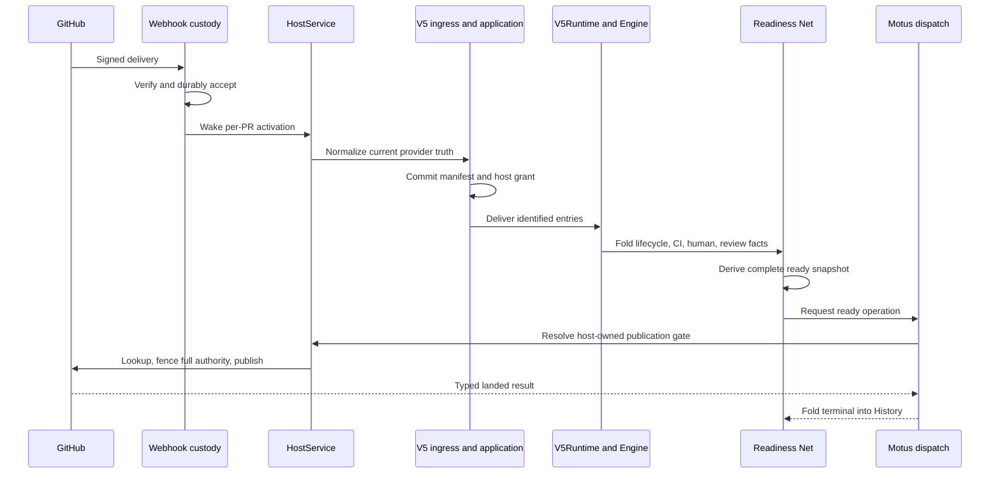

# Clean-green reconciliation journey

This is the first guided reading route for ES-009. It follows one recognizable
behavior from provider ingress to an immutable readiness advisory. The listed
order is a dependency narrative; independent Petri folds may interleave.

## Scenario

`tests/integration/host/test_readiness_scenarios.py` supplies an open, non-draft,
mergeable PR with:

- a current strict base;
- a successful required `build` job;
- one qualifying approval;
- no requested reviewers or unresolved threads; and
- a clear agent review with no findings.

The expected externally visible result is one mutable dashboard and one immutable
readiness advisory. No finding, rerun, Git publication, ref mutation, or merge is
allowed.

## Vertical sequence

### 1. Durable ingress

Read:

- `src/hamsterdan/github_app/webhooks.py` — `WebhookCustody.receive`
- `src/hamsterdan/host/service.py` — `HostService.process`,
  `_select_observation`, and `_activate_instance`

The webhook callback is a wake hint, not workflow truth. Custody verifies size,
content type, delivery identity, supported event, and signature before recording a
pending inbox row. The host then reloads due rows in durable order for one PR.

### 2. Normalize and grant authority

Read:

- `src/hamsterdan/host/v5/application.py` — `process_observation` and
  `_deliver_manifest`
- `src/hamsterdan/host/v5/ingress.py` — `_project`, `stage`, and `_reduce`

Fresh provider data becomes strict host-owned values. `V5IngressStore.stage`
atomically commits an immutable ingress manifest and advances the host authority
grant before Petrus receives any entry. For clean green, the manifest admits head,
ready-state, human, and run evidence.

### 3. Enter canonical History

Read:

- `src/hamsterdan/host/v5/runtime.py` — `open`, `deliver`, `fold_ingress`, and
  `drain`
- `src/hamsterdan/readiness/net_v5/topology.py` — `build_net_v5` and
  `seed_marking`

One PR owns one Petrus Engine and JSONL History. Identified ingress enters
canonical History, then the runtime selects the exact lifecycle fold for that
entry. The topology composes lifecycle control with nine cohabited concern loops;
the loops communicate through typed facts rather than concrete references.

### 4. Produce readiness evidence

Read:

- `src/hamsterdan/readiness/net_v5/life.py`
- `src/hamsterdan/readiness/net_v5/ci.py`
- `src/hamsterdan/readiness/net_v5/review.py`
- `src/hamsterdan/readiness/net_v5/readiness.py`

Lifecycle admission establishes incarnation 1 and current head/base/policy. CI
folds exact-head success. The review loop creates a stable review operation,
executes a credential-free agent request, and folds a clear review with zero
blocking findings. Human evidence contributes approval and no unresolved
collaboration blockers.

Readiness folds current authority before incarnation-scoped facts. It authorizes
an advisory only after every required predicate is satisfied and its typed
mailboxes are quiet.

### 5. Execute a typed effect

Read:

- `src/hamsterdan/readiness/net_v5/gating.py`
- `src/hamsterdan/host/v5/gates.py` — `announce_gate`
- `src/hamsterdan/github_app/effects.py` — `CommentPublisher.find` and
  `CommentPublisher.immutable`

The ready candidate becomes an operation such as `ready:<HEAD>:i1`. Motus records
and dispatches the request durably. Immediately before a provider mutation, the
host rechecks the complete claim: phase, incarnation, head, base, policy,
strict-base status, base currency, and active Activity identity.

Publication is lookup-first. A stable embedded marker lets recovery discover that
GitHub already accepted the exact operation after a lost response, avoiding a
second mutation.

### 6. Fold the terminal

The provider result is encoded as a strict result variant and routed to one typed
terminal place. Readiness folds the landed terminal, records the incarnation as
announced, and clears the in-flight announcement state. The result is now part of
canonical History rather than an assumption inferred from the HTTP call.

## Two durable commit frontiers

A useful teaching model is:

1. **Admission frontier:** the host commits which provider truth and authority
   the workflow may reason from.
2. **Effect frontier:** Petrus records the operation and GitHub's stable marker
   identifies whether that exact external effect landed.

The Net derives readiness between these frontiers without owning GitHub
credentials.

## Working terminology

### Host authority grant

A host authority grant is Hamsterdan's durable record of the exact repository
state that the trusted host has admitted for workflow decisions. In code this
state is represented as `CurrentClaim` and persisted in the
`v5_authority_grants` table.

It contains:

- lifecycle phase: running, quiescent, or terminal;
- incarnation: the workflow generation number;
- current PR head;
- current base;
- current policy digest.

It is not a GitHub permission, credential, installation token, or OAuth grant.
“Grant” means that the host permits the workflow to reason and request effects
under this exact claim. Before an external effect, the host compares the
Activity's claim with both this durable record and fresh provider truth. Any
moved field invalidates the effect.

For example, the host may record: “generation 4 may act for head C, base M, and
policy P7.” If the PR advances to head D before publication, an Activity carrying
the generation-4/head-C claim is refused.

## Navigator teach-back

### Webhook as wake hint

The Navigator identified the central safety property: an older notification must
not overwrite newer repository authority or dispatch work that no longer makes
sense.

The implementation sharpens that model. Hamsterdan does not wait for a later
“good” delivery and does not generally compare webhook payload snapshots by age.
A supported signed delivery durably identifies the PR and wakes processing; at
custody execution, `V5IngressNormalizer` freshly reads the current PR, policy,
base currency, human review, and exact-head Actions evidence. A delayed
`synchronize` delivery for head A can therefore admit current head C.

Not every old delivery is discarded. Same-PR custody is processed in durable row
order, and authenticated lifecycle actions preserve draft, ready, and close edges
which a later provider snapshot may have collapsed. Startup and periodic
reconciliation can also refresh persisted PRs after a missed follow-up event.
Finally, current-authority fencing prevents a previously authorized external
effect from executing after authority has moved.

### Atomic admission before History

The Navigator identified the split-state failure. If Petrus History admitted head
C while the durable host authority grant still named head B, the Net could derive
a correct head-C result but the host would reject its external effect because the
Activity claim and host grant disagree.

Hamsterdan first commits the frozen ingress manifest and updated host grant in one
SQLite transaction. It then delivers that manifest to Petrus. This ordering leaves
recoverable crash cuts:

- a crash before the transaction leaves neither the new manifest nor the grant;
- a crash after the transaction but before History leaves a frozen manifest that
  restart can deliver;
- a crash after History delivery can replay the same identified entries without
  inventing a different provider snapshot.

The forbidden state is History admitting head C while the host still authorizes
head B.

### Authority can move while an Activity waits

The Navigator identified two primary changes between readiness authorization and
provider execution: a new head may replace the authorized head, or a user may
return the PR to draft. Both update the host grant while the queued Activity keeps
its original claim.

The full fence also accounts for other authority changes:

- the base commit or readiness policy changes;
- the PR closes or merges;
- the lifecycle incarnation advances;
- installation or repository routing no longer admits the PR;
- strict-base status or base currency moves before publication.

A queued Activity remains durable, but durability does not preserve authority.
The host refuses it when its claim no longer matches current authority.

### Lookup precedes authorization during recovery

The Navigator identified the accepted-but-unknown case: GitHub may already contain
the exact effect even though the lost response prevented Hamsterdan from recording
the terminal result.

Recovery first performs a read-only lookup for the stable operation marker. If it
finds the effect, Hamsterdan records the operation as landed. Current authority
cannot undo an effect GitHub already accepted. If lookup finds nothing, the host
then checks current authority before allowing a new mutation.

An authority-first check after head C moves to D would reject the old claim before
observing that its comment already landed. The direct risk is an unresolved or
misclassified Activity which may churn recovery. When authority remains at C,
lookup-first also prevents a duplicate post.

Lookup answers whether the operation already happened. The authority fence
answers whether a new mutation may happen now.

### Canonical History and disposable wakes

The Navigator identified `history.jsonl` as workflow truth and
`runnable.sqlite3` as a wake index. With intact History, a lost runnable database
can be replaced and rebuilt from startup reconciliation, pending custody,
Activity terminals, and canonical timer state. A new webhook is one wake source,
not the only recovery route.

The missing-History case exposed a separate correctness finding. Current code
accepts `binding.json` without History to cover a crash before a new Engine's
first record. It cannot distinguish that valid initialization cut from deletion
of an established History. A later active-route trigger can create a fresh Engine
instead of reconstructing or consistently refusing the damaged PR. Surviving
hints and operation ledgers cannot prove that no workflow ran and cannot rebuild
the prior Petri marking.

The full finding is recorded in [Missing canonical History
finding](history-loss-finding.md).
