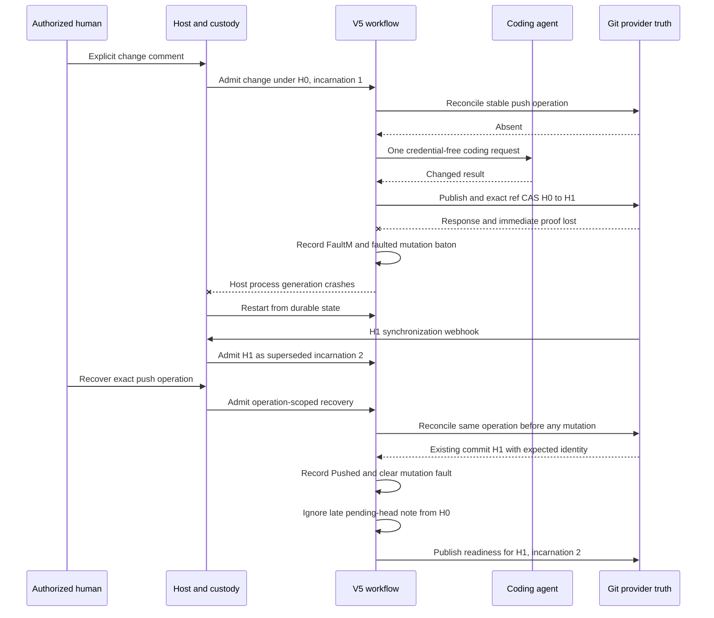

# Git-ambiguity recovery journey

This is the third guided reading route for ES-009. It follows one branch update
which GitHub accepts while Hamsterdan loses the response and cannot immediately
prove the result. The host records a typed mutation fault, restarts, admits the
new provider head before recovery, then uses an explicitly authorized
`recover_publication` comment to prove the original operation without another
coding run or Git mutation.

## Scenario

`tests/integration/testing/test_readiness_world.py` begins from a clean-green PR
at head H0 and incarnation 1. An authorized owner comment requests one ordinary
`change`. The deterministic coding boundary returns a changed result. The
modeled Git publisher then:

1. accepts the branch update from H0 to H1;
2. loses the response;
3. makes the first reconciliation proof unavailable; and
4. causes `V5MutationGate` to return `FaultM`.

The host crashes after the typed fault has entered canonical History. After
restart, a pull-request webhook admits H1 as incarnation 2 before publication
recovery. CI is successful and review is clear for H1, but the global mutation
fault still blocks readiness.

A second authorized comment names the exact original publication operation. The
workflow opens a new Activity occurrence with the retained work. Lookup-first
reconciliation finds the existing operation and returns `Pushed` before reading
the old authority claim, calling the coding agent, or publishing again. The late
pending-head note is inert because lifecycle already stands on H1. The mutation
fault clears and readiness may publish for H1 at incarnation 2.

The expected external result is one coding execution, one accepted Git
publication, two `git_gate` Activity occurrences, terminals `FaultM` then
`Pushed`, and one readiness advisory for the admitted H1 generation.

## Vertical sequence



The sequence names causal boundaries. Independent folds and publications may
interleave.

## 1. Create one stable change operation

Read:

- `tests/integration/testing/test_readiness_world.py` —
  `test_real_v5_recovers_one_ambiguous_authorized_git_publication_after_crash`;
- `src/hamsterdan/readiness/net_v5/conversation.py` — `_classify`;
- `src/hamsterdan/readiness/net_v5/mutation.py` — `_op_key` and `_start`; and
- `src/hamsterdan/host/v5/mutation.py` — `V5MutationGate.git_gate`.

Comment 501 is classified as an explicit `change`. The workflow derives:

```text
conversation operation = conversation:owner/repo:pr:7:delivery:<change-delivery>
request identity       = comment:501
publication operation  = push:comment:501:<H0>:i1
coding operation       = mutation:owner/repo:pr:7:<publication-operation>
```

The publication operation becomes the Activity correlation and idempotency
value. A payload digest binds schema version, semantic operation, policy, and the
complete coding request.

The mutation gate reconciles this operation before reading authority or calling
the coding agent. The initial lookup proves coherent absence, so the gate checks
the full H0 claim, calls the agent once, checks authority again, and sends the
changed result to the publisher.

## 2. Accept the ref update but lose proof

Production `HostGitPublisher.publish` creates stable operation and payload-digest
trailers, rereads the PR, advances the ref with exact non-force compare-and-swap,
and reconciles again. A successful provider call is not enough; reconciliation
must prove coherent PR and remote-ref heads plus exactly one matching commit with
the expected parents.

The deterministic World injects `ModeledGitPublisher` behind the production
mutation gate. Its `ref_cas` fault means:

- record exactly one Git publication;
- move provider authority from H0 to deterministic H1;
- mark the response as lost;
- make the first proof lookup unavailable; and
- raise a `REF_CAS` publication error.

`V5MutationGate` responds to `REF_CAS` by reconciling once more. In this scenario
the proof is still unavailable, so the gate cannot return `Pushed`. It returns a
typed `FaultM` containing the original operation, H0 authority, mutation kind,
instruction, and recovery fields.

Historical real-provider evidence recorded in
`docs/process/worklog/entries/2026-08-17T0644Z-v5-operation-scoped-recovery-qualified-locally.md`
observed the same safety posture: the exact ref compare-and-swap landed while
GitHub's immediate PR projection still reported the old head, and V5 retained
`FaultM` rather than manufacturing `Pushed`.

## 3. Make ambiguity durable and fail closed

Read:

- `src/hamsterdan/readiness/net_v5/mutation.py` — `_fold_fault`;
- `src/hamsterdan/readiness/net_v5/readiness.py` — mutation and fault fact folds;
  and
- `src/hamsterdan/host/v5/runtime.py` — `_settle_agent_routes`.

`FaultM` is a domain result encoded as `ActivityCompleted` with variant
`FaultM`. Activity execution finished and produced a typed answer; external Git
truth remains unresolved.

`mutation._fold_fault` creates:

- `MutState(state="faulted")` with the complete retained work;
- `MutationSettled(outcome="faulted")` for escalation;
- a global operation-keyed `FaultRaisedFact` for readiness; and
- dashboard evidence.

The mutation baton remains faulted. Later mutation requests are declined before
another gate attempt because the actual provider head may already have moved.
Readiness requires both an empty pending ledger and an empty fault ledger, so it
cannot announce while the operation remains ambiguous.

The runtime deliberately does not settle the global agent route when a
`git_gate` occurrence completes as `FaultM`. `AgentRouteStore` therefore keeps
the coding operation bound to the same exact agent composition. Known terminals
`Pushed`, `MovedM`, and `DeclinedM` settle that route; `FaultM` leaves it
recoverable.

## 4. Distinguish two recovery states

A missing Activity terminal and a durable `FaultM` are different states.

### Activity request without a terminal

Canonical History contains `ActivityRequested` but no `ActivityCompleted` or
`ActivityFailed`. Engine reconstruction automatically redispatches the same
occurrence with the frozen input, policy, correlation, and idempotency. No human
comment is required.

`tests/unit/readiness/net_v5/test_inline_recovery.py` proves that repeated process
loss can call the same logical coding operation again while its agent ledger
executes only once and the ref advances only once. Once the terminal enters
History, another restart dispatches nothing.

### Activity completed as `FaultM`

The occurrence is terminal, so restart does not redispatch it. The workflow has
classified the external outcome as unresolved and now requires product-level
human authority to reopen that exact operation.

The reopening creates a new Activity occurrence number. It preserves the same
`MutWork`, publication operation, Activity correlation and idempotency, payload
digest, and coding operation.

This is the central terminology trap on the journey: `FaultM` is terminal for
one Activity occurrence but unresolved for the logical mutation and agent route.

## 5. Restart with a faulted logical operation

The World crash revokes the current host-process generation and constructs a new
`HostService`, application, and Engine over the same durable root. Canonical
History, ingress and authority stores, custody, timers, Dispatch state, and
runnable hints remain available. Modeled provider truth remains at H1 outside
the reconstructed host.

After restart:

```text
provider head       = H1
host grant          = H0, incarnation 1
mutation baton      = faulted under the original push operation
Activity occurrence = terminal FaultM
agent route         = unresolved under the original coding operation
readiness fault     = mutation:<publication-operation>
```

This World crash closes and reconstructs real host resources in one Python
process. It is not an operating-system process kill.

## 6. Admit the provider head before recovery

The test next supplies successful CI and a clear review for H1, then delivers a
signed `pull_request/synchronize` webhook.

No `ProvisionalHead` was emitted from `FaultM`, so lifecycle has no expected
head. It admits H1 as `superseded`, increments to incarnation 2, and resets
head-scoped checks, review, findings, and pending mutation state. Human review
state persists under current policy.

The operation-keyed mutation fault is global rather than incarnation-scoped. It
survives H1 admission and keeps readiness closed even after H1's CI and review
are green.

This ordering has one accepted cost: because H1 was admitted before recovery,
its CI budget receives a fresh lineage. Later recovery cannot retroactively
reclassify H1 as Hamsterdan's confirmed head or restore the old lineage.

## 7. Authorize one exact recovery

Read:

- `src/hamsterdan/github_app/webhooks.py` — `admit_conversation`;
- `src/hamsterdan/host/v5/application.py` — `_intent_arg` and declarations;
- `src/hamsterdan/readiness/net_v5/conversation.py` — recovery prefix routing;
  and
- `src/hamsterdan/readiness/net_v5/mutation.py` — `_recover`.

Comment 502 must come from an admitted trusted user, explicitly address the App,
and contain the complete operation verbatim. The conversation classifier must
return one declared `recover_publication` intent whose only argument is that
operation.

The prefix `push:` routes the resulting `RecoverFact` to `mut.recover`. Prefix
routing selects the owner; it does not authorize arbitrary state. The mutation
fold independently requires:

```text
target is mutation
MutState is faulted
requested operation equals retained op_key
```

A recovery for another loop, another operation, an idle mutation baton, or a
terminal workflow is inert or declined.

`mutation._recover` reconstructs the exact original `MutWork`. It emits a fresh
pending fact and clears the exact mutation fault when the human authorizes the
new round. If the operation faults again, `_fold_fault` restores the fault.

## 8. Reconcile before old-authority checks

The new `git_gate` occurrence begins with the same lookup performed by every
mutation attempt. The modeled provider now proves the original operation exists
at H1. Production `HostGitPublisher.reconcile` would require:

1. coherent PR projection and remote branch ref;
2. one complete first-parent history search;
3. exactly one matching operation trailer;
4. exactly one matching payload-digest trailer; and
5. the exact expected parent sequence.

An `existing` result returns `Pushed` immediately. The gate does not:

- read the retained incarnation-1 authority claim;
- call the coding agent;
- create Git objects; or
- attempt another ref compare-and-swap.

Lookup must precede authority here. Current authority is H1 at incarnation 2,
while the retained work correctly names H0 at incarnation 1. Authority answers
whether a new mutation may happen now; reconciliation first answers whether the
old mutation already happened.

## 9. Fold the late success without rewriting lifecycle

`mutation._fold_pushed` returns the mutation baton to idle, settles the operation
as landed, clears its pending identity where current, and emits:

```text
ProvisionalHead(expected=H1, from_head=H0, op="change", lineage="")
```

Lifecycle already stands on H1. `life._note_provisional` installs an expectation
only while current head equals `from_head`. The late note is therefore inert. It
cannot leave `expected == current head`, cannot wedge future committing intents,
and cannot rewrite H1's prior `superseded` admission.

The recovery round's pending and settled facts carry incarnation 1. Readiness is
already on incarnation 2, so it ignores those stale per-incarnation facts. The
global operation-keyed fault clear still applies. Once that fault disappears,
the already-folded H1 checks, review, collaboration, and authority facts can
make incarnation 2 ready.

## 10. Fixed and generated evidence

Executed on 2026-08-24:

```sh
PYTHONDONTWRITEBYTECODE=1 uv run --frozen pytest -q -p no:cacheprovider \
  tests/integration/testing/test_readiness_world.py::test_real_v5_recovers_one_ambiguous_authorized_git_publication_after_crash \
  tests/unit/readiness/net_v5/test_mutation_loop.py::TestFaultAndRecovery::test_a_late_recovery_note_cannot_wedge_lifecycle
```

Result: 2 passed in 4.73 seconds.

The fixed World test asserts:

- one accepted Git publication with a lost response;
- host crash and reconstruction;
- H1 admission before recovery;
- one admitted recovery carrying the exact operation and delivery identity;
- at least three Git reconciliations;
- typed terminals `FaultM` then `Pushed`;
- one recovered provider publication rather than a second publication;
- final readiness for current H1 authority;
- checker failure if recovery authorization is removed;
- checker failure if the recovered terminal head is corrupted; and
- exact deterministic replay with the same operation count.

The generated campaign was also executed:

```sh
PYTHONDONTWRITEBYTECODE=1 uv run --frozen pytest -q -p no:cacheprovider \
  tests/integration/testing/test_readiness_campaign.py::test_generated_v5_git_publication_recovery_schedules_replay_exactly
```

Result: 1 passed in 30.30 seconds with one Hypothesis warning that the recursion
limit changed from 1000 to 2500 during execution.

The campaign runs four explicit semantic anchors plus five deterministic
Hypothesis examples across:

- response returned or lost;
- no crash, before-delivery crash, after-acceptance crash, or after-head crash;
- duplicate old-delivery redelivery or no redelivery; and
- deterministic seed variation.

Every schedule requires one provider Git publication, one coding execution,
`Pushed` alone for definite outcomes or `FaultM` then `Pushed` for ambiguity,
final readiness, semantic coverage, and exact replay.

## What the World executes

The World uses production:

- `HostService` and FastAPI webhook route;
- signature verification and durable webhook custody;
- V5 ingress manifests and authority grants;
- non-sharded V5 application, runtime, Engine, topology, and canonical History;
- mutation, conversation, lifecycle, and readiness folds;
- typed Motus Activity request and terminal handling; and
- host restart over the same durable root.

It models:

- GitHub PR, CI, review, comment, and effect truth;
- conversation and coding agent terminals;
- Git publication and reconciliation;
- response loss and proof availability; and
- the resulting deterministic commit hash.

The independent readiness model and checker do not import the host or topology.
They compare expected semantics with detached provider, host-grant, History, and
publication observations.

## Evidence limits

These limits describe the World and generated campaign, not the whole test
suite:

- The injected publisher does not run real clone, patch, object creation, commit
  trailers, first-parent search, or GraphQL `updateRefs`. Focused Git publisher
  tests and prior real-provider evidence own those mechanics.
- Modeled ref truth and PR projection move together. A one-shot proof-unavailable
  flag stands in for independent remote-ref, PR-projection, and commit-visibility
  delays.
- The post-acceptance crash happens after `FaultM` has been classified and folded,
  not in the micro-cut between provider acceptance and Activity terminal append.
- Restart reconstructs host resources in the same Python process. It does not
  test interpreter kill, filesystem buffers, or WAL recovery after OS death.
- Response-lost schedules always admit H1 before explicit recovery. The
  complementary order, recovery before H1 admission, is covered by focused
  topology tests but is not generated here.
- The fixed test relies on continuous checker parity rather than directly
  asserting the intermediate state "H1 green but readiness blocked by mutation
  ambiguity."
- The generated schedule grammar varies four parameters around one fixed script;
  it does not generate arbitrary repeated crashes, recoveries, or authority
  movements.

## Navigation and locality findings

These observations remain exploratory:

- `terminal` has two meanings. `FaultM` terminates one Activity occurrence while
  the mutation baton and logical agent route remain unresolved.
- Two `git_gate` requests under one idempotency key mean one failed-proof
  occurrence and one lookup-first recovery occurrence, not two provider
  mutations. History alone does not show the whole effect count; provider proof
  must be joined.
- `generation` may refer to a host-process generation, independent-model
  generation, or V5 lifecycle incarnation. They happen to advance together in
  parts of this scenario but have separate owners.
- `fault_git_publication(..., "ref_cas")` reads like a rejected compare-and-swap.
  Its actual modeled behavior is accepted CAS, lost response, and one unavailable
  proof lookup.
- Recovery spans human admission, classifier validation, operation-prefix
  routing, retained mutation state, Activity occurrence identity, agent-route
  custody, provider proof, and lifecycle ordering. Each boundary has a distinct
  owner, but the vertical explanation is expensive to reconstruct.

The deletion test does not identify a shallow production module. Removing the
mutation loop would move durable fault and recovery decisions into the provider
adapter. Removing the host mutation gate would give the Net agent and provider
knowledge. Removing the Git publisher would mix patch admission and Git proof
with workflow classification. Removing lifecycle would let publication results
rewrite authority directly. Removing agent-route custody would permit one
logical recovery operation to change agent composition across restart.

## Navigator teach-back

### Mechanical recovery versus judgment

The Navigator identified that an unterminated Activity occurrence is mechanically
safe to redispatch, while a durable fault requires judgment. History has not yet
classified an outcome in the first case, so Petrus can replay the same frozen
occurrence under stable identity. `FaultM` is already a typed terminal which says
provider truth remains ambiguous. Current policy therefore stops automatic
execution until a trusted human names and reopens that exact operation.

The human does not decide whether the Git effect landed. The human authorizes one
new proof attempt. Lookup-first reconciliation still determines provider truth.

### Lookup before authority

The Navigator identified that lookup-first ordering prevents the recovery attempt
from failing against moved authority. More precisely, it prevents a false
rejection: current H1/incarnation-2 authority may be the result of the old
H0/incarnation-1 operation itself. Recovery first asks whether that operation
already happened. Only coherent absence permits the later question of whether a
new mutation remains authorized.

### Two occurrences and one effect

The Navigator identified the second occurrence as the lookup. Occurrence 1
reconciles absent, runs the coding agent, lands the H0-to-H1 compare-and-swap, and
returns `FaultM` when proof remains unavailable. After the crash and explicit
recovery, occurrence 2 reconciles the same logical operation as existing and
returns `Pushed` before agent or publication work. The Activity occurrence
numbers differ; publication operation, payload, and provider effect identity do
not.

### Incarnation-2 ownership

The Navigator identified that a late pending-head note cannot shortcut or disturb
incarnation 2. H1 already entered workflow authority through provider observation.
If the old settlement installed `expected=H1` afterward, committing intents could
remain provisional forever because no future head transition would clear an
expectation equal to the current head. The `from_head=H0` fence makes the note
inert once lifecycle no longer stands on H0. Recovery proves publication but does
not retroactively reclassify H1, restore lost lineage, or rewrite incarnation 2.
