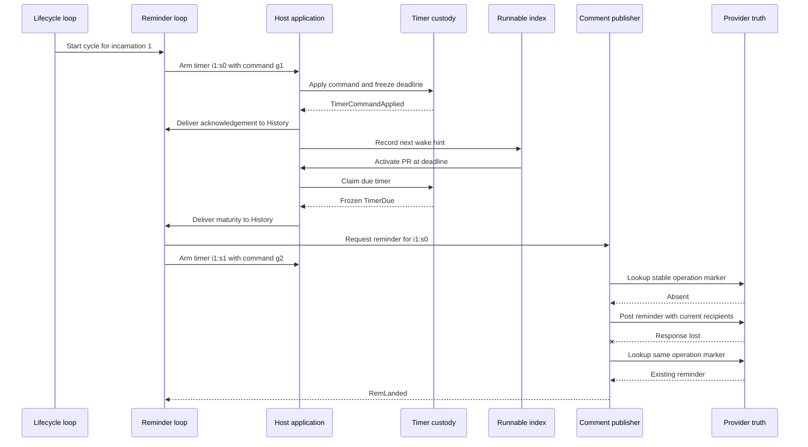

# Reminder-timer recovery journey

This is the fourth guided reading route for ES-009. It follows one active PR
from lifecycle admission through a durable reminder timer, host restart,
identified maturity, lookup-first reminder publication, and the next timer
cycle.

## Scenario

`tests/integration/testing/test_readiness_world.py` starts an active PR at head
H1 with successful CI and a clear agent review. Lifecycle admission starts timer
`i1:s0` with a one-day delay. At maturity, the reminder loop requests one
operation-identified comment and arms `i1:s1`.

The modeled provider accepts the first reminder but loses its response. The
comment is immediately visible, so `CommentPublisher` finds the stable marker
during its bounded recovery and returns `existing`. The World then reconstructs
the host and converges with one reminder, one matured timer, one next timer, and
current readiness.

The timer is lifecycle-driven. Active head admission starts it, draft pauses it,
ready-for-review resumes it, and close ends it. Approval and readiness do not
control eligibility. In this World the policy requires zero approvals, no
reviewer is requested, and readiness is already published. The reminder asks
the author to assign a reviewer while readiness remains current.

## Vertical sequence



The sequence names causal boundaries. Independent folds and Activity settlement
may interleave.

## 1. Start the cycle from lifecycle admission

Read:

- `src/hamsterdan/readiness/net_v5/life.py` — `_admit_head`,
  `_admitted_state_outputs`, `_admit_draft`, `_admit_ready`, and `_admit_human`;
- `src/hamsterdan/readiness/net_v5/reminders.py` — `_cycle`; and
- `src/hamsterdan/contracts/readiness_v5.py` — `ReminderCycleStarted`,
  `ReminderCyclePaused`, and `RemState`.

A newly admitted active head increments `LifeState.incarnation` and emits
`ReminderCycleStarted`. A same-head authority refresh does not start another
cycle. A new head or ready-for-review resume creates a new incarnation and a new
sequence-zero timer.

Human observations take a separate route. `_admit_human` sends `HumanFact` to
readiness and dashboard processing but emits no reminder mail. Approval,
changes-requested state, and unresolved conversations therefore do not start,
pause, or cancel the reminder clock.

For the fixed scenario:

```text
subject       = github:44:31:pr:7
incarnation   = 1
head          = aaaaaaaaaaaaaaaaaaaaaaaaaaaaaaaaaaaaaaaa
timer         = timer:github:44:31:pr:7:i1:s0
delay         = 86400 seconds
```

## 2. Serialize timer intent through one command

Read:

- `src/hamsterdan/readiness/net_v5/reminders.py` — `_timer`, `_operation`,
  `_issue_arm`, and `_command_applied`; and
- `src/hamsterdan/host/v5/runtime.py` — `timer_command`.

The reminder loop derives stable identities:

```text
timer identity   = timer:{subject}:i{incarnation}:s{sequence}
command identity = timer-command:{subject}:g{generation}
```

The first cycle places one `TimerCommand` in `rem.commands` and records an
`ArmingReminderClock` in the reminder baton. The command remains intentional Net
to host work until the exact `TimerCommandApplied` returns.

Only one command may be outstanding. If draft or a newer incarnation arrives
while an arm is awaiting acknowledgement, the loop updates `desired_timer` but
keeps the existing command. Once its acknowledgement arrives, the loop issues
the required cancel or replacement arm.

## 3. Freeze the deadline in timer custody

Read:

- `src/hamsterdan/host/v5/application.py` — `settle`; and
- `src/hamsterdan/host/v5/timers.py` — `V5TimerStore.apply`, `pending_ack`, and
  `mark_ack_delivered`.

`PrReadinessV5Application.settle()` drains the runtime, then gives pending timer
acknowledgements priority over new commands. Applying an arm runs one SQLite
transaction which:

1. requires the next contiguous command generation;
2. reads the host clock;
3. computes and freezes the deadline;
4. supersedes any older armed timer;
5. inserts the new armed timer and exact command result; and
6. advances the stored command generation.

Exact command replay returns the stored result and original deadline. Reusing
one operation identity with another command fails. A partial unique index
permits at most one armed timer for the subject.

The host delivers the result with identity:

```text
v5-timer-command-applied:{command-operation}
```

After that identified fact enters canonical History, the reminder loop consumes
the command and records `ArmedReminderClock` with the accepted deadline.

## 4. Distinguish the three state owners

The timer path has three state owners.

### Canonical History and Net marking

Canonical History owns accepted workflow facts. Reconstructed Net marking owns
the outstanding `TimerCommand`. Identified `TimerCommandApplied` records the
accepted deadline, and identified `TimerDue` records accepted maturity.

### `timers.sqlite3`

The per-PR timer database owns durable host custody around the History boundary.
It applies commands, freezes deadlines, claims maturity, and remembers whether
acknowledgement and maturity facts reached History.

The database is reconstructible after History contains the corresponding facts.
One crash window is deliberately fail-closed: an applied arm whose
`TimerCommandApplied` has not entered History has a deadline known only to timer
custody. If that database is missing or corrupt, the host cannot distinguish a
never-applied command from an applied command whose deadline was lost. It raises
`V5 timer store cannot recover an unacknowledged arm` rather than inventing a
new deadline.

### `runnable.sqlite3`

The host-wide runnable index stores a wake hint under:

```text
(instance, petri-timer, next-maturation)
```

It carries no workflow fact or timer identity. Startup can recreate it from the
next deadline returned by application settlement.

## 5. Turn wall-clock eligibility into workflow truth

Read:

- `src/hamsterdan/host/v5/timers.py` — `claim_due`, `pending_maturity`, and
  `mark_maturity_delivered`;
- `src/hamsterdan/host/v5/runtime.py` — `deliver_timer_due`; and
- `src/hamsterdan/readiness/net_v5/reminders.py` — `_mature`.

Wall-clock passage makes an armed timer eligible for a host claim.
`V5TimerStore.claim_due()` atomically changes one due timer from `armed` to
`matured` and freezes its maturity:

```text
value    = TimerDue(timer, due_at, matured_at)
identity = v5-timer-due:{timer-id}:{due-at-microseconds}
```

This claim is durable host custody. The identified `TimerDue` becomes workflow
truth when `V5Runtime.deliver_timer_due()` appends it to canonical History.

Concrete crash cut: if the host crashes after `claim_due()` but before History
delivery, `pending_maturity()` returns the same frozen value on restart. The Net
has not observed maturity until the delivery succeeds.

The reminder loop records every delivered maturity, including stale and repeated
facts. A nudge requires an exact match between the current armed clock, the
complete timer, and its deadline. A stale maturity remains durable but inert.

## 6. Request one nudge and arm the next cycle

Read:

- `src/hamsterdan/readiness/net_v5/reminders.py` — `_request_nudge`, `_next_after`,
  `_fold_landed`, `_fold_blocked`, and `_fold_fault`; and
- `src/hamsterdan/readiness/net_v5/gating.py` —
  `IdentifiedInlineActivityHandler.prepare`.

An exact unsnoozed maturity places the timer in the reminder baton's `pending`
map and emits `RemReq`. It also derives sequence `s1` and emits the next arm
command before the current publication settles.

The reminder Activity freezes the same value as correlation and idempotency:

```text
reminder:{timer-id}
```

A landed terminal clears pending custody. Retry exhaustion produces
`RemBlocked`, which an exact human recovery instruction may reopen under the
same operation. An unknown terminal produces `RemFault`, which maturity alone
cannot reopen. Later timer generations proceed independently of an older
blocked or faulted publication.

Snooze suppresses the nudge decision rather than the maturity fact. A snoozed
maturity becomes overdue and does not arm another timer until resume. Draft
cancels the current armed timer. Close waits for pending publication and timer
command custody before the reminder baton retires.

## 7. Reconcile the reminder by operation presence

Read:

- `src/hamsterdan/host/v5/gates.py` — `V5PublicationGates.reminder_gate`;
- `src/hamsterdan/github_app/effects.py` — `CommentPublisher.reminder_operation`,
  `immutable`, and `reminder`; and
- `src/hamsterdan/host/v5/application.py` — `current_claim`, `_recipients`, and
  `_publisher_fence`.

`reminder_operation` searches all bot-authored issue comments for the final
marker matching the reminder operation under any head. Marker presence proves
the logical nudge landed. The current body, recipient, dashboard link, and head
do not need to match a newly rendered reminder.

Concrete moved-head recovery:

1. `reminder:i1:s0` lands under H1.
2. Its Activity terminal is lost.
3. The PR moves to H2.
4. Redispatch searches for `reminder:i1:s0` and finds the H1 marker.
5. The gate returns `RemLanded` before reading the H2 claim or recipients.

If no marker exists, the lazy context reads the current staged claim, current
requested reviewer, and current author. The reminder addresses the reviewer
when present. Otherwise it asks the author to assign one.

Reminder publication bypasses the full publication claim fence. This is
separate from presence-only recovery. An existing marker settles without a new
write; an absent marker proceeds using current context without the immediate
pre-POST claim comparison used by readiness and finding publication. The parked
`RS-021` refinement owns the missing route-revocation fence shared by inline V5
Activities.

## 8. Rebuild after a lost runnable hint

Read:

- `src/hamsterdan/host/service.py` — `_activate_instance`, `_record_posture`, and
  `run_due`;
- `tests/integration/host/test_service.py` —
  `test_selected_v5_restart_rebuilds_timer_after_crash_before_runnable_hint`;
  and
- `tests/unit/host/test_v5_ingress.py` — timer acknowledgement, maturity, and
  runnable reconstruction tests.

The host restart test uses a ten-second delay:

1. `i1:s0` arms at time 1 for time 11.
2. At time 11, `i1:s0` matures and one reminder posts.
3. The loop arms `i1:s1` for time 21.
4. The host crashes before `_record_posture()` stores the new wake.
5. The test removes both timer and runnable SQLite projections.
6. Startup rebuilds timer custody from canonical History and recreates one wake.
7. Running due work at time 11 posts nothing.
8. Running due work at time 21 matures `i1:s1` and posts the next reminder.

This proves that accepted timer facts can rebuild both projections without an
early or duplicate reminder.

## 9. Fixed and generated evidence

Executed on 2026-08-24:

```sh
PYTHONDONTWRITEBYTECODE=1 uv run --frozen pytest -q -p no:cacheprovider \
  tests/unit/readiness/net_v5/test_reminders_loop.py
```

Result: 20 passed in 1.42 seconds.

```sh
PYTHONDONTWRITEBYTECODE=1 uv run --frozen pytest -q -p no:cacheprovider \
  tests/unit/host/test_v5_timers.py \
  tests/unit/host/test_v5_ingress.py::test_v5_settle_reaches_timer_fixed_point_and_returns_canonical_store_deadline \
  tests/unit/host/test_v5_ingress.py::test_timer_ack_crash_cuts_replay_one_identity_and_original_deadline \
  tests/unit/host/test_v5_ingress.py::test_timer_maturity_history_marker_crash_replays_without_duplicate_fact \
  tests/unit/host/test_v5_ingress.py::test_disposable_runnable_index_rebuilds_from_intact_timer_custody \
  tests/unit/host/test_v5_ingress.py::test_v5_close_cancels_exact_host_timer_before_reminder_loop_retires \
  tests/integration/host/test_service.py::test_selected_v5_restart_rebuilds_timer_after_crash_before_runnable_hint
```

Result: 28 passed in 1.40 seconds.

```sh
PYTHONDONTWRITEBYTECODE=1 uv run --frozen pytest -q -p no:cacheprovider \
  tests/integration/testing/test_readiness_world.py::test_real_host_recovers_one_ambiguous_reminder_after_timer_maturity_and_crash \
  tests/unit/host/test_v5_gates.py::TestReminderGate \
  tests/unit/github_app/test_github.py::test_operation_scoped_reminder_reconciles_presence_only_across_a_head_move \
  tests/unit/github_app/test_github.py::test_operation_scoped_reminder_posts_under_the_current_head_when_never_held \
  tests/unit/github_app/test_github.py::test_reminder_mentions_configured_reviewer_and_never_assigns \
  tests/unit/github_app/test_github.py::test_reminder_asks_author_to_assign_without_inventing_a_reviewer
```

Result: 11 passed in 1.99 seconds.

The generated campaign was also executed:

```sh
PYTHONDONTWRITEBYTECODE=1 uv run --frozen pytest -q -p no:cacheprovider \
  tests/integration/testing/test_readiness_campaign.py::test_generated_reminder_timer_recovery_schedules_replay_exactly
```

Result: 1 passed in 17.49 seconds. Hypothesis warned that the recursion limit
changed from 1000 to 2500 during execution and would not be reset.

The campaign runs four explicit anchors plus five deterministic generated
examples across stable, new-head, draft/resume, and closed paths; three crash
cuts; response loss; initial delivery redelivery; and seed variation. Every
accepted non-closed schedule requires one reminder for the current incarnation,
one acknowledged timer, one next scheduled timer, exact replay, and lookup
recovery when the response is lost. The closed path requires no reminder and a
canceled timer.

## What the World executes

The World uses production:

- `HostService` composition and reconstruction;
- signed webhook routing and durable custody;
- V5 ingress, application, runtime, Engine, History, and topology;
- the reminder loop and `V5TimerStore`;
- runnable scheduling;
- typed reminder Activity binding;
- `V5PublicationGates`; and
- `CommentPublisher` lookup and bounded publication recovery.

It models:

- GitHub PR, review, comment, and effect truth;
- provider response loss and visibility;
- logical time;
- agent results; and
- command order and host-generation crashes.

The independent readiness model derives expected timer posture from admitted
authority events and logical time. Actual timer custody comes from a detached
SQLite query rather than the production reminder fold.

## Evidence limits

- The fixed World recovers the lost provider response before its later host
  crash. It proves response-loss recovery followed by reconstruction, not
  unresolved provider ambiguity across restart.
- A focused inline-Activity test owns the stronger boundary. It discards two
  Activity terminals across runtime loads and proves one provider post under the
  same reminder operation.
- World crashes reconstruct host resources in one Python process. They do not
  test operating-system kill, filesystem tear, or WAL recovery after power loss.
- The modeled provider makes the accepted reminder immediately visible. The
  campaign does not combine response loss with delayed comment visibility.
- Generated crash cuts are command boundaries, not instruction-level cuts inside
  SQLite, Petrus append, or provider calls.
- The campaign samples four anchors and five generated examples from forty valid
  categorical combinations before seeds. It is not exhaustive.
- No real GitHub route, authentication renewal, pagination timing, rate limit,
  or eventual consistency behavior is exercised.
- The evidence supports at-least-once execution with stable identity and
  lookup-first convergence. It does not establish exactly-once external effects.

## Navigation and locality findings

These observations remain exploratory:

- Reminder eligibility is lifecycle-driven, while the original experiment
  wording assumed missing qualifying human readiness. Product documentation
  does not state which policy is intended.
- The fixed World test name suggests ambiguity persists across restart, but
  `CommentPublisher` resolves the lost response before the crash.
- `test_a_repeated_maturity_reconciles_lookup_first` records a repeated maturity
  after the clock has advanced to the next timer. The exact-clock guard makes it
  inert before another gate lookup.
- `mature()` in the reminder-loop test silently admits a head and acknowledges
  the arm when setup is absent. Reading only a test body hides two durable
  boundaries.
- `canonical` has a narrow meaning here. History owns accepted timer facts;
  timer SQLite is durable custody but rebuildable after acknowledgement;
  runnable SQLite is a disposable wake index.
- `unfenced` means the reminder bypasses the full publication claim fence. It
  does not mean a new write skips current claim and recipient reads.

The deletion test does not identify a shallow production module. Removing the
reminder loop would move product decisions into timer custody. Removing the
timer store would lose the crash-safe bridge around History. Removing runtime
projection would make SQLite interpret raw Petrus records. Removing the runnable
index would force timer custody to become a scheduler. Removing the publisher
would put provider marker rules into the workflow or host composition.

## Navigator teach-back

### Reconstructible wakes and the unacknowledged-arm boundary

The Navigator identified `runnable.sqlite3` as fully reconstructible from the
accepted timer deadline. The timer store also rebuilds after
`TimerCommandApplied` enters History. Before that acknowledgement, timer SQLite
may hold the only frozen deadline. Losing it creates an ambiguity between a
never-applied arm and an applied arm whose deadline disappeared, so startup
fails closed.

### Maturity as workflow truth

The Navigator identified the exact boundary: maturity becomes workflow truth
when the identified `TimerDue` enters canonical History. `claim_due()` first
freezes host custody. That pending value can replay after a crash without the
Net acting early.

### Operation-scoped settlement across heads

The Navigator identified the operation-scoped marker as the recovery mechanism.
A reminder posted under H1 settles after movement to H2 because lookup searches
for the same operation under any head before reading current H2 context. The
full-fence bypass is a separate rule for an absent marker and a possible new
write.

### Lifecycle control

The Navigator identified admission as the start and draft as the pause.
Completing the boundary, a new head starts sequence zero under a new
incarnation, ready-for-review resumes under a new incarnation, and close ends
the cycle. Approval does not control it.
